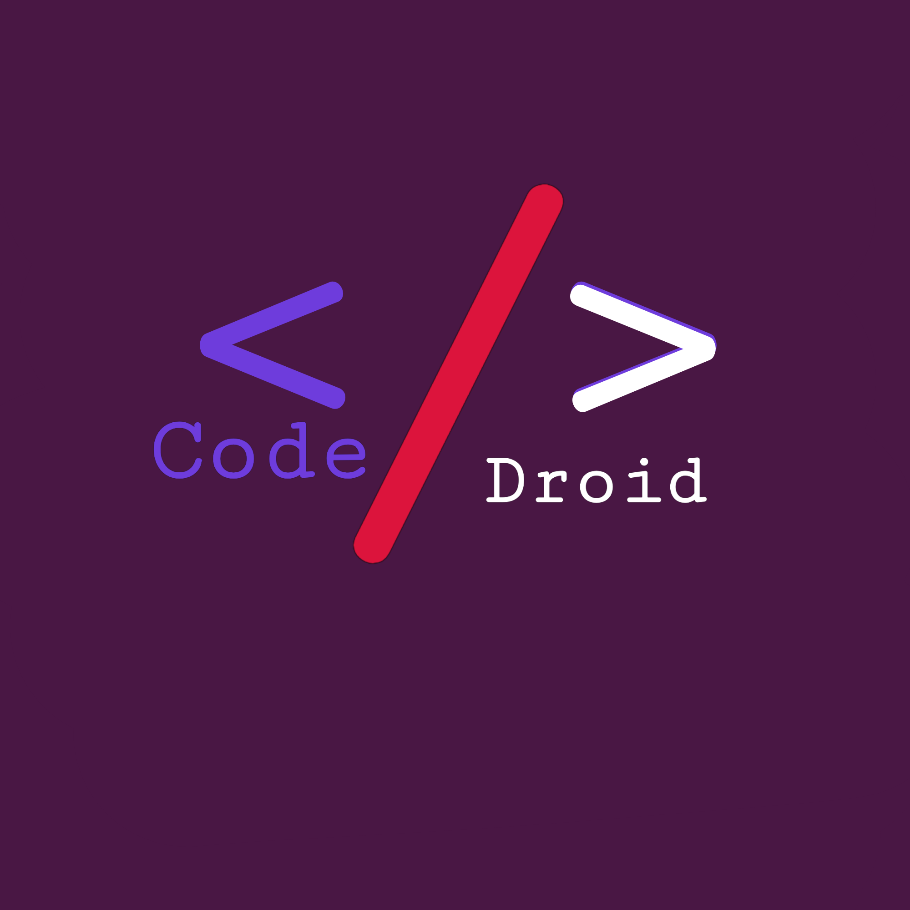

# CodeDroid — Mobile Code Editor



Editor kode HTML, CSS, dan JavaScript yang berjalan langsung di browser HP. Tidak perlu install aplikasi tambahan — cukup buka di Chrome dan langsung coding.

---

## ✨ Fitur

- **Editor lengkap** dengan syntax highlighting tema Monokai
- **Multi-tab** — buka banyak file sekaligus
- **Live Preview** — lihat hasil HTML/CSS/JS secara langsung
- **Console** — lihat log, error, dan jalankan ekspresi JS
- **File Manager** — buat, rename, hapus, dan kelola file & folder
- **Simpan ke HP** — simpan langsung ke penyimpanan HP tanpa export (Chrome)
- **Buka dari HP** — buka file atau folder langsung dari storage HP
- **Format Kode** — auto-format HTML, CSS, dan JSON
- **Quick Toolbar** — tombol karakter khusus untuk coding lebih cepat di HP
- **PWA** — bisa diinstall dan dipakai offline
- **Tema Monokai** — tema gelap ramah mata untuk coding malam hari

---

## 🚀 Cara Pakai

### Proyek Baru
1. Buka app → tap **Proyek Baru**
2. Pilih folder di HP untuk menyimpan file
3. App otomatis membuat `index.html`, `style.css`, dan `script.js`
4. Mulai coding!

### Buka File dari HP
1. Tap ikon **📁 Files** → **Buka File** atau **Buka Folder**
2. Pilih file/folder dari storage HP
3. Semua file langsung terhubung — tap 💾 untuk simpan langsung ke HP

### Simpan
- Tap tombol **💾** di topbar → simpan langsung ke file di HP
- Pertama kali akan muncul dialog pilih lokasi, selanjutnya otomatis
- Notifikasi **✅ Tersimpan** muncul di sebelah nama file

### Preview
- Tap tombol **▶** untuk menjalankan dan melihat hasil kode
- Tab **Preview** menampilkan hasil render HTML/CSS/JS secara langsung

---

## 📁 Struktur Proyek

```
CodeDroid/
├── index.html          # App shell utama
├── manifest.json       # PWA manifest
├── sw.js               # Service Worker (offline support)
├── assets/
│   ├── icon.webp       # Icon utama
│   ├── icon-192.png    # Icon PWA 192x192
│   └── icon-512.png    # Icon PWA 512x512
├── logic/
│   ├── app.js          # Orchestrator utama
│   ├── editor.js       # CodeMirror editor wrapper
│   ├── files.js        # File system virtual
│   ├── storage.js      # IndexedDB storage
│   ├── preview.js      # Preview iframe renderer
│   └── console.js      # Console panel
└── style/
    ├── app.css         # Style utama
    ├── editor.css      # Style editor
    └── monokai.css     # Tema Monokai
```

---

## 🛠 Teknologi

- **Vanilla JS** — tanpa framework
- **CodeMirror 5** — editor dengan syntax highlighting
- **IndexedDB** — penyimpanan file di browser
- **File System Access API** — simpan/buka file langsung ke storage HP
- **Service Worker** — PWA & offline support

---

## 📱 Kompatibilitas

| Browser | Editor | Simpan ke HP |
|---------|--------|--------------|
| Chrome Android | ✅ | ✅ |
| Chrome Desktop | ✅ | ✅ |
| Firefox | ✅ | ❌ |
| Safari | ✅ | ❌ |

> Fitur **Simpan ke HP** membutuhkan **File System Access API** yang saat ini hanya didukung Chrome.

---

## 📄 Lisensi

MIT License — bebas digunakan dan dimodifikasi.
